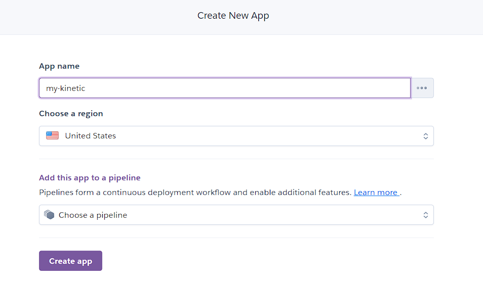
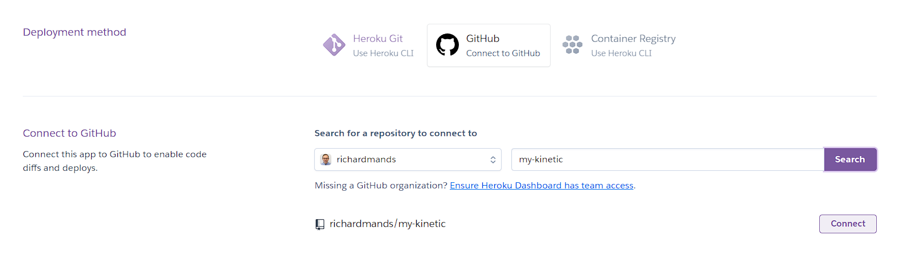
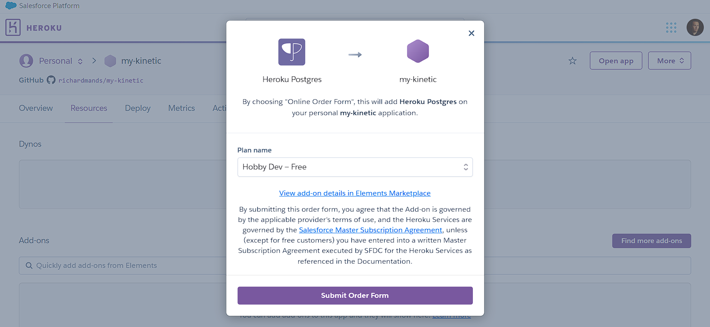
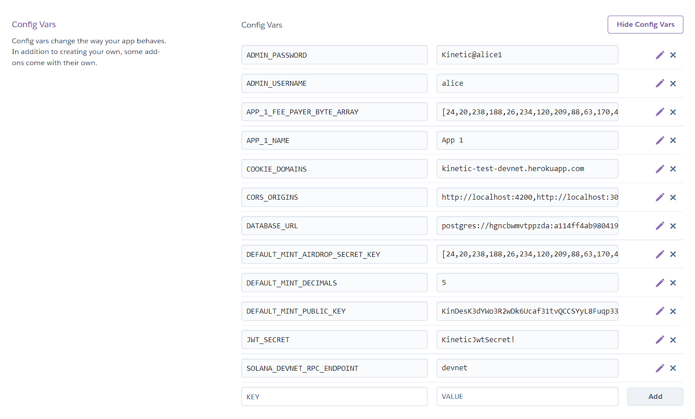
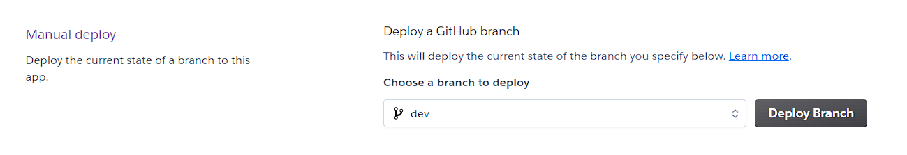

# Kinetic Deployment
## Deploying Kinetic to Heroku

Here we will show how you can deploy your own Kinetic Instance to Heroku.

### Fork Kinetic
Fork you own version of Kinetic that we'll use to deploy on Heroku
<div class='navIcons'>
  <a href='https://github.com/kin-labs/kinetic/fork/' target='_blank'><div class='navIcon'>
    
    <span class='navIcon-text'>Fork Kinetic</span>
  </div></a>
</div>

### Sign Up To Heroku 
<div class='navIcons'>
  <a href='https://dashboard.heroku.com/apps/' target='_blank'><div class='navIcon'>
    
    <span class='navIcon-text'>Heroku Account</span>
  </div></a>
</div>

### Create a new App


### Choose the GitHub Deployment Method
Select your forked Repo and Connect<br/>


### Install Postgres Addon
Go to Overview / Configure Add-ons, search and choose the Heroku Postrgres addon.<br/>


### Set your Environment Variables
Go to Settings / Config Vars and add your environment variables as you would have in your `.env` file when [running Kinetic locally](/developers/production/#prepare-your-environment-variables).<br/>
Make sure not to include quote marks around your strings as Heroku won't filter them out.<br/>


### Deploy Kinetic
Go to Deploy / Manual Deploy and deploy Kinetic. You can also choose to set up automatic deployment.



### Open your App
That's it! You should be good to go. Click 'Open app' to open the Kinetic Manager. Heroku has great options for viewing logs etc through the online console and also has a brilliant CLI if you want to go down that route.

### Configure Your Kinetic Instance with Kinetic Manager
<div class='navIcons'>
  <a href='/developers/kinetic-manager/'><div class='navIcon'>
    
    <span class='navIcon-text'>Configure Kinetic</span>
  </div></a>
</div>

## Running Kinetic Locally

#### Requirements:
```js
Node.js 14+
Docker 20+
Yarn v1.22+
```

#### Get Started
To get started with Kinetic, pull down the [Kinetic](https://github.com/kin-labs/kinetic) repo and install dependencies.

```js
git clone git@github.com:kin-labs/kinetic.git
cd kinetic
yarn install
```
#### Prepare your Environment Variables
Kinetic is highly configurable, but don't worry, we've provided an example file you can use to get started quickly.<br/>
Just copy the contents of the `.env.example` file into your own `.env` file.<br/>
See the full list of environment variables <a href='https://github.com/kin-labs/kinetic/blob/dev/.env.example' target='_blank'>here</a>.

#### Make sure Docker is running
<div class='navIcons'>
  <a href='https://www.docker.com/' target='_blank'><div class='navIcon'>
    
    <span class='navIcon-text'>Docker</span>
  </div></a>
</div>


#### Run Kinetic Services
Then, in separate terminals, do each of the following:

- run the database
```js
yarn dev:services:postgres
```
- prepare the database
```js
yarn prisma migrate reset && yarn prisma db push
```
- run Solana locally (`localhost:8899`) or set `SOLANA_DEVNET_RPC_ENDPOINT=devnet` and skip this step
```js
yarn dev:services:solana
```
- run the Kinetic API (`localhost:3000`)
```js
yarn dev:api
```
- run the Kinetic Manager (`localhost:4400`)
```js
yarn dev:admin
```
- run the Kinetic Demo App (`localhost:4200`)
```js
yarn dev:demo
```

#### Open The Kinetic Manager
- Kinetic Manager is a full-featured GUI for Kinetic
- You can log in using the details set in your `.env` file.
- <a href='http://localhost:4400' target='_blank'>Click here</a> to open localhost:4400
#### Open The Kinetic Demo
- Use the built-in Kinetic Demo to test Kin transactions on your Kinetic instance
- <a href='http://localhost:4200' target='_blank'>Click here</a> to open localhost:4200


## What If I Get Stuck?

Fortunately, we have an amazing developer community on our Developer Discord server. Join today!

<div class='navIcons'>
<a href='/essentials/getting-help/'><div class='navIcon'>
    
    <span class='navIcon-text'>Getting Help</span>
  </div></a>
  <a href='https://discord.com/invite/kdRyUNmHDn' target='_blank'><div class='navIcon'>
    
    <span class='navIcon-text'>Developer Discord</span>
  </div></a>
</div>


***
**Was this page helpful?**<br/>
If you'd like to tell us how we can make these docs better, let us know here:

<div class='navIcons'>
  <a href='https://forms.gle/qhjcDJR59v8RJsaY7' target='_blank'><div class='navIcon'>
    
    <span class='navIcon-text'>Feedback</span>
  </div></a>
</div>
