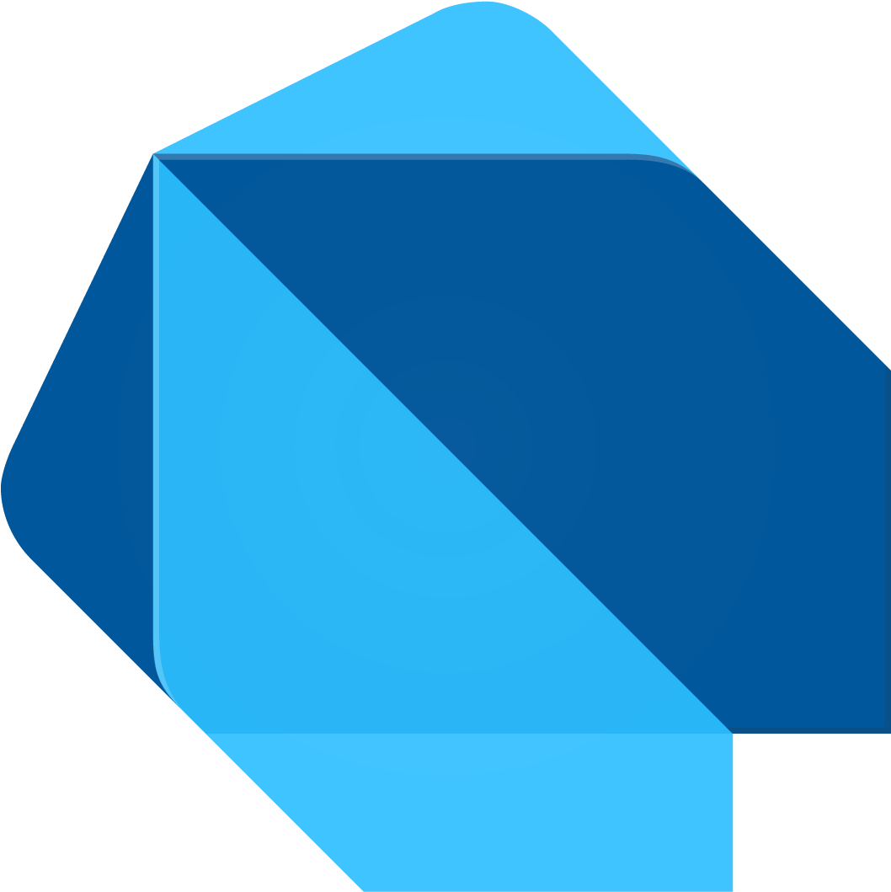

# Developers
## Kinetic SDKs

Kin offers a range of SDKs to make connecting your App to the blockchain as seamless as possible. 

These SDKs are powered by Kinetic.

### What is Kinetic?

Kinetic is a suite of tools that make it easy to build apps that integrate Solana.

It provides a consistent and clean abstraction over the Solana SDKs and enhances it with some commonly requested features like paying Solana fees on behalf of the user, tracking and timing the users transactions and sending out webhooks.

Kinetic is aimed at developers that want to build crypto-experiences for the users of their app, hiding a lot of the details about the blockchain out of sight for both the developer and the end user.

  <a href='https://github.com/kin-labs/kinetic/' target='_blank'>

    
    Kinetic GitHub
  
</a>

### Do I need to understand Kinetic to use Kin?
No! Our Kinetic SDKs have been designed so that you can start building straight away, without needing to jump through a bunch of hoops.

### Select your preferred language:

  <a href='/developers/typescript/'>

    
    TypeScript
  
</a>
  <a href='/developers/python/'>

    
    Python
  
</a>
  <a href='/developers/cdn/'>

    
    Web (CDN)
  
</a>
  <a href='/developers/ios-swift/'>

    
    iOS (Swift)
  
</a>
  <a href='/developers/android-kotlin/'>

    
    Android (Kotlin)
  
</a>
  <a href='/developers/android-java/'>

    
    Android (Java)
  
</a>
  <a href='/developers/unity/'>

    
    Unity
  
</a>
  <a href='/developers/flutter-dart/'>

    
    Flutter (Dart)
  
</a>

## SDK-less
Alternatively, go [SDK-less](/developers/sdk-less/) and transact directly on Solana. It's a bit trickier to set-up, but you can still use Kin and earn via the KRE.

  <a href='/developers/sdk-less/'>

    
    Solana
  
</a>

## Ready for Production?
If your App is ready for production, this is the place for you!

  <a href='/developers/production/'>

    
    Production
  
</a>

***
**Was this page helpful?** 
If you'd like to tell us how we can make these docs better, let us know here:

  <a href='https://forms.gle/qhjcDJR59v8RJsaY7' target='_blank'>

    
    Feedback
  
</a>

