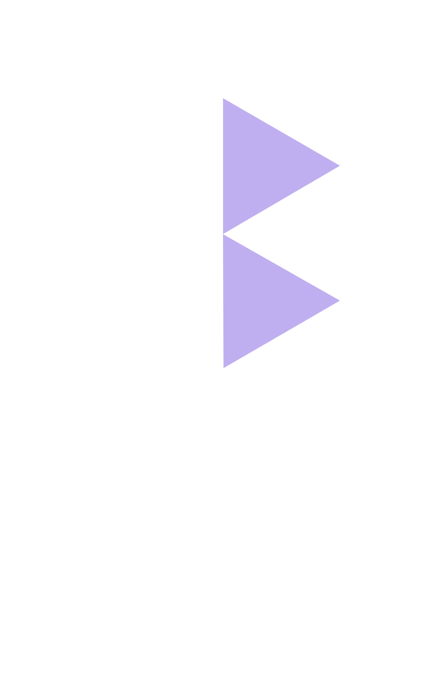

# Production

## Are You Ready?
Before moving your application onto the Mainnet, it's good practice to make sure you're able to transact on the Devnet. If it's all working how you want, then let's get going!

## Connecting to Mainnet
When you set up your Kinetic Client using one of our SDKs, you need to set your environment. This can be either `devnet` or `mainnet`. For Production, you should choose `mainnet`.

For example, here's how it works with the TypeScript SDK:
```JS
const clientOptions = {
    environment : 'mainnet', // mainnet or devnet
    index : 999, // your App Index
    endpoint: 'https://your_kinetic_instance' // optional kinetic endpoint
};

const kineticClient = await KineticSdk.setup(clientOptions);
```
You'll notice in the example above, you can pass in an optional `endpoint` when you set up the Kinetic Client. <br/> This setting gives us some options in the ways we can connect to Kinetic on mainnet:

<div class='navIcons'>
  <a href='/developers/production/#kin-hosted'><div class='navIcon'>
    
    <span class='navIcon-text image-logo-text'>Kin <br/>Hosted</span>
  </div></a>
  <a href='/developers/production/#self-hosted'><div class='navIcon'>
    
    <span class='navIcon-text'>Self Hosted</span>
  </div></a>
  <a href='/developers/production/#3rd-party-hosted'><div class='navIcon'>
    
    <span class='navIcon-text'>3rd Party Hosted (Coming Soon)</span>
  </div></a>
</div>

## Kin Hosted
This is the easiest option and what we recommend for small-scale Apps that are just getting started with Kin.
- Get insights into your transactions
- Get insights into your hot-wallet usage
- Restrictions apply
- Only Kin is available, no other mints
- Kinetic version can be updated by the Kin team <br/>(meaning you might have to handle API updates to stay connected)
- Limited logs availability (1 week)

### How To Connect
Just point to `mainnet` as your environment when you instantiate your Kinetic Client via your SDK of choice.
E.g. TypeScript SDK:
```JS
const clientOptions = {
    environment : 'mainnet', // mainnet or devnet
    index : 999, // your App Index
};

const kineticClient = await KineticSdk.setup(clientOptions);
```
That's it!


## Self Hosted
For larger scale Apps or those looking for more control.

- Get insights into your transactions
- Get insights into your hot-wallet usage
- Configure multiple mints (e.g. other tokens, nfts, etc)
- Stay on a specific Kinetic version
- Unlimited log retention
- Configure multiple hot-wallets
- Customisable (Open Source)

### Connecting To Your Own Kinetic Instance
Point to `mainnet` as your `environment` and set your `endpoint` to where you've deployed your own Kinetic Instance.
E.g. TypeScript SDK:
```JS
const clientOptions = {
    environment : 'devnet', // mainnet or devnet
    index : 999, // your App Index
    endpoint: 'https://your_kinetic_instance' // your kinetic server address
};

const kineticClient = await KineticSdk.setup(clientOptions);
```
This is the easy bit. Below, we'll explain how to run, deploy and manage your own Kinetic instance.
### Running Kinetic Locally

#### Requirements:
```
Node.js 14+
Docker 20+
Yarn v1.22+
```

#### Get Started
To get started with Kinetic, pull down the [Kinetic](https://github.com/kin-labs/kinetic) repo and install dependencies.
```
git clone git@github.com:kin-labs/kinetic.git
cd kinetic
yarn install
```
#### Prepare your Environment Variables
Kinetic is highly configurable, but don't worry, we've provided an example file you can use to get started quickly.<br/>
Just copy the contents of the `.env.example` file into your own `.env` file.<br/>
See the full list of environment variables <a href='https://github.com/kin-labs/kinetic/blob/dev/.env.example' target='_blank'>here</a>.

#### Make sure Docker is running
<div class='navIcons'>
  <a href='https://www.docker.com/' target='_blank'><div class='navIcon'>
    
    <span class='navIcon-text'>Docker</span>
  </div></a>
</div>


#### Run Kinetic Services
Then, in separate terminals, do each of the following:

- run the database
```
yarn dev:services:postgres
```
- prepare the database
```
yarn prisma migrate reset && yarn prisma db push
```
- run Solana locally (`localhost:8899`) or set `SOLANA_DEVNET_RPC_ENDPOINT=devnet` and skip this step
```
yarn dev:services:solana
```
- run the Kinetic API (`localhost:3000`)
```
yarn dev:api
```
- run the Kinetic Manager (`localhost:4400`)
```
yarn dev:admin
```
- run the Kinetic Demo App (`localhost:4200`)
```
yarn dev:demo
```

#### Open The Kinetic Manager
- Kinetic Manager is a full-featured GUI for Kinetic
- You can log in using the details set in your `.env` file.
- <a href='http://localhost:4400' target='_blank'>Click here</a> to open localhost:4400
#### Open The Kinetic Demo
- Use the built-in Kinetic Demo to test Kin transactions on your Kinetic instance
- <a href='http://localhost:4200' target='_blank'>Click here</a> to open localhost:4200
### Deploy your Kinetic Instance to Heroku
Learn how to deploy your self-hosted Kinetic instance to Heroku
<div class='navIcons'>
  <a href='/developers/deployment/'><div class='navIcon'>
    
    <span class='navIcon-text image-logo-text'>Deploy Kinetic</span>
  </div></a>
</div>

### Configure Your Kinetic Instance with Kinetic Manager
See how you can use Kinetic Manager to configure your self-hosted Kinetic instance
<div class='navIcons'>
  <a href='/developers/kinetic-manager/'><div class='navIcon'>
    
    <span class='navIcon-text'>Configure Kinetic</span>
  </div></a>
</div>


## 3rd Party Hosted

Coming Soon! 

We'll let you know here as and when 3rd Party Hosting solutions become available.

Stay tuned!


***
**Was this page helpful?**<br/>
If you'd like to tell us how we can make these docs better, let us know here:

<div class='navIcons'>
  <a href='https://forms.gle/qhjcDJR59v8RJsaY7' target='_blank'><div class='navIcon'>
    
    <span class='navIcon-text'>Feedback</span>
  </div></a>
</div>
