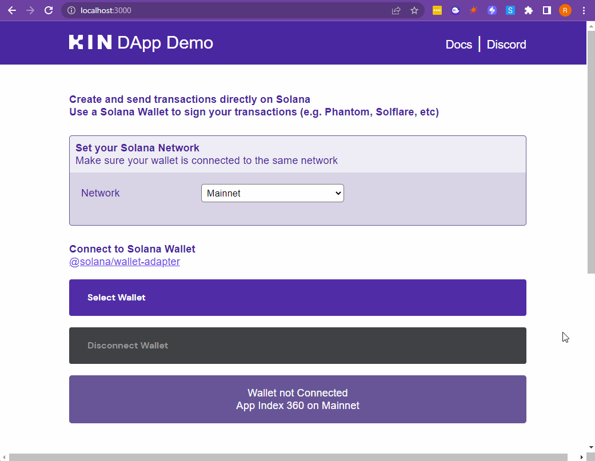
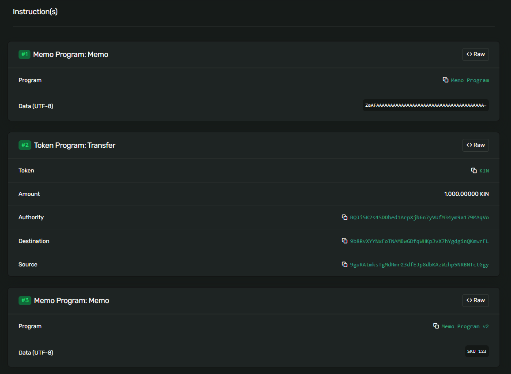
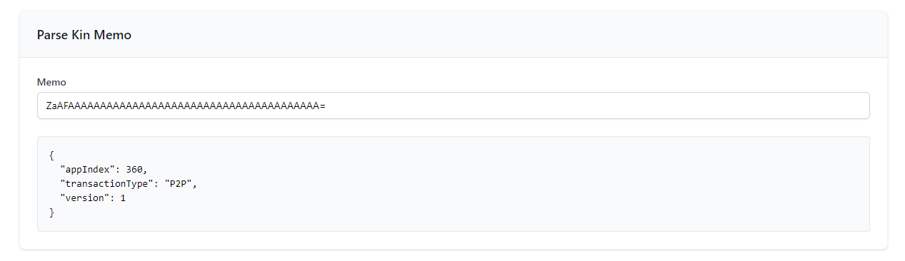
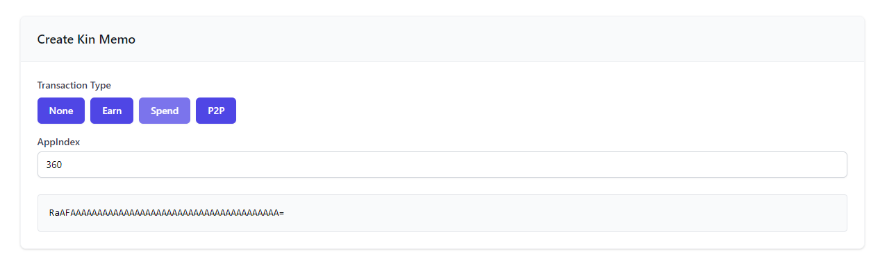
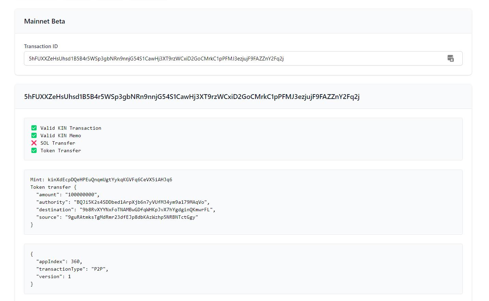
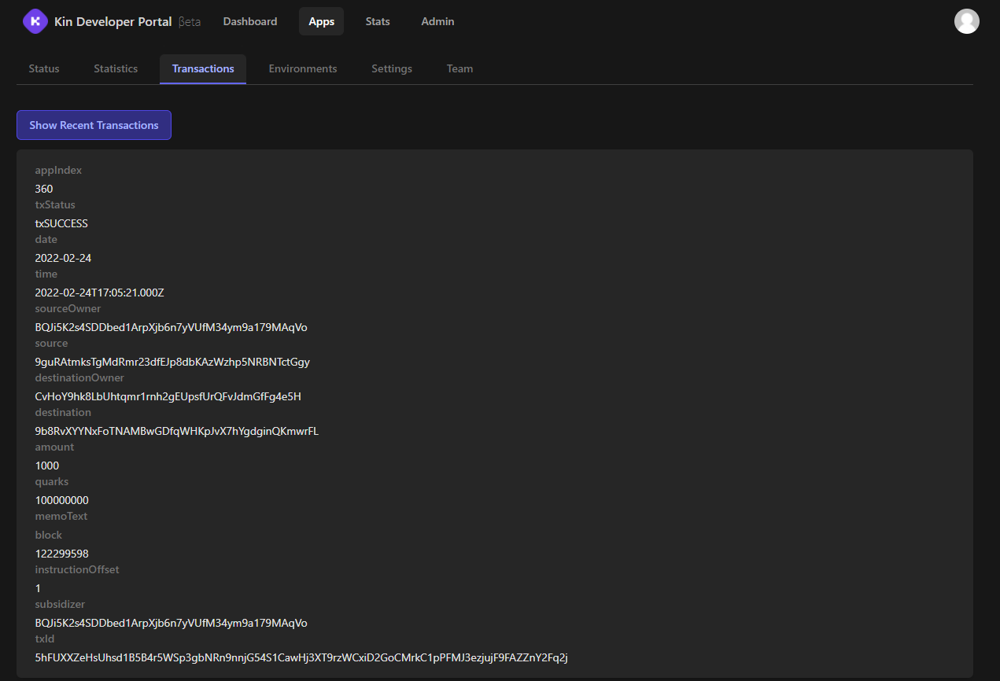

So, as a Web3 developer who loves Kin as much as we do, you'd like to create a DApp that allows users to sign transactions with their own Solana wallet (E.g. Phantom, Solflare, etc) while still taking advantage of the lovely Kin KRE?

Well, here we can show you how to do just that!



## Solana Transactions

However you are interacting with the Solana blockchain (in the above example, we used the [@solana/web3.js](https://www.npmjs.com/package/@solana/web3.js/v/0.30.8) npm package), you need to construct and sign a transaction. In order to be picked up by our ingestor so you can get your KRE rewards, the transaction needs to have the right instructions, and have those instructions come in the right order.

[Here's](https://explorer.solana.com/tx/5hFUXXZeHsUhsd1B5B4r5WSp3gbNRn9nnjG54S1CawHj3XT9rzWCxiD2GoCMrkC1pPFMJ3ezjujF9FAZZnY2Fq2j) an example of a successful transaction (the one above in the gif).


This transaction contains 3 instructions.

## Memo Containing App Index 
### REQUIRED - First Instruction
We can see above that the first instruction uses the `Memo Program` and contains the data `ZaAFAAAAAAAAAAAAAAAAAAAAAAAAAAAAAAAAAAAAAAA=`.

Using our [Kin Laboratory](https://laboratory.kin.org/memo), we can parse that string to see the details of the memo.



We can also use the Laboratory to create correctly formatted memos in the first place.



## Token Transfer
### REQUIRED - Second Instruction
This is the step containing the the amount of Kin and where it is going.

## Other Instructions
### OPTIONAL
In the example above, we've used `Memo Program v2` to add some SKU info about the transaction.

## How about the code?
To try it yourself, check out our [Kin DApp Demo](https://github.com/kin-labs/kin-dapp-demo).

Look [here](https://github.com/kin-labs/kin-dapp-demo/blob/master/src/helpers/SDKless/handleSendKin.ts) if you want to skip straight to creating transactions.

TLDR?
```JavaScript
const transaction = new Transaction()
    .add(appIndexMemoInstruction) // Must be the first instruction
    .add(transferInstruction);

await sendTransaction(transaction, connection);
```

## Did it work?
To check if your transaction was correctly formatted, again head over to our [Kin Laboratory](https://laboratory.kin.org/transaction) and check the status of your transaction.



You should also be able to see the transaction when you log in to the [Kin Developer Portal](https://portal.kin.org/dashboard).



And that's it! The specific implementation will be different depending on how you are interacting with Solana, but the basic principle applies, and as long as you've created your transaction correctly, you should be good to go!

If you have any issues, please drop us a line in our [Developer Discord](https://discord.gg/kdRyUNmHDn) and jump into our `sdk-less` [channel](https://discord.com/channels/808859554997469244/946095829205266533)

## Demos and Starter Kits
Created to help get you up and running as quickly as possible, these projects can be a great reference point when you get stuck or even a starter for your own project. Happy coding!

### [Kin SDK-less DApp Demo](https://github.com/kin-starters/kin-dapp-sdk-less)
A lightweight web-based implementation of Kin SDK-less with a fully functional Next.js based interface.

### [Kin DApp Playground](https://github.com/kin-starters/kin-dapp-playground)
A multi-functional Kin Front-End that allows you to connect to a Kin Server or carry out Web-based transactions via our Web-SDK or SDK-less.

***
**Was this page helpful?**<br/>
If you'd like to tell us how we can make these docs better, let us know here:

<div class='contacts-index'>
  <a href='https://forms.gle/qhjcDJR59v8RJsaY7' target='_blank'><div class='contact'>
    
    <span class='contact-text'>Feedback</span>
  </div></a>
</div>
