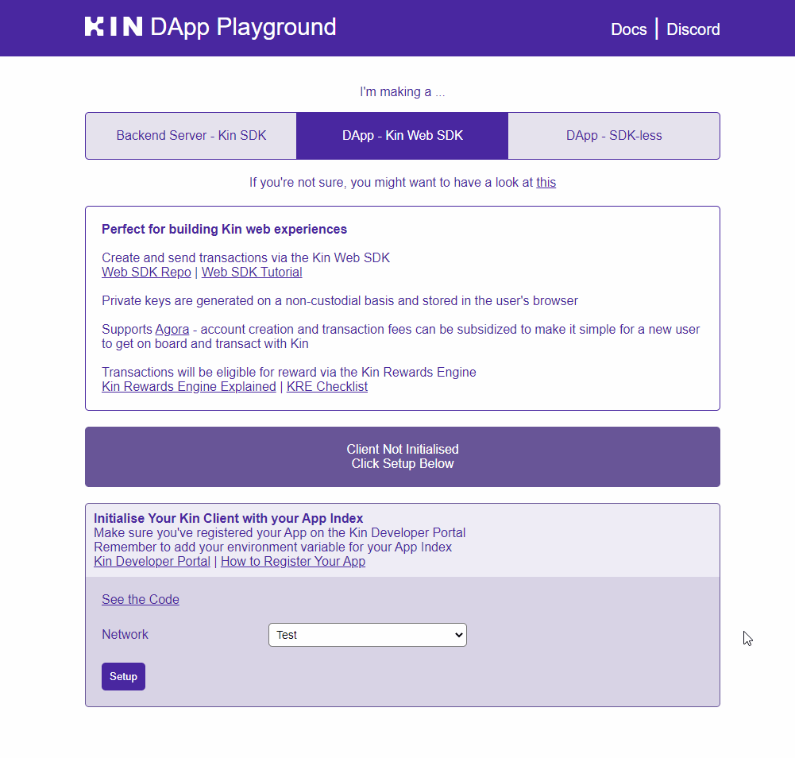

# Node SDK

## Implementing Kin in your app
This tutorial will take you through the basics of creating a Kin enabled app using Node.js.

### Requirements

Make sure you have read [Getting Started](/tutorials/#getting-started) and have the required environment variables


#### 1. Install the Kin SDK for Node to your project:

```shell
npm install @kinecosystem/kin-sdk-v2
# Or if you use yarn
yarn add @kinecosystem/kin-sdk-v2
```

#### 2. Create a Node.js app and add the [kin.ts](https://github.com/kintegrate/kin-starter-node/blob/main/src/kin.ts) class to your app

This class abstracts some calls to Kin's official SDK and is fully usable out of the box. However, you can easily extend it to suite your custom needs.

#### 3. Instantiate a new Kin client

We're creating a new instance of our Kin wrapper and pass in the environment. In this example we'll pick the Test network.

```js
// Set up Kin client
const kin = new Kin(Environment.Test);
```

#### Congratulations! You now have a Kin enabled app running!

### Making calls to the Kin blockchain

In this example, we're going to create a new wallet for both Alice and Bob by generating new key pair. After the wallet is created, Alice will send a P2P transaction to Bob.

#### 4. Create account for Alice

We create a new private key-pair for Alice, then call into our wrapper to create a new account. After creation, we log out the public address of both the wallet, and the balances

```js
const privateKeyAlice = Kin.generateKey();
const balancesAlice = await kin.createAccount(privateKeyAlice);

console.log(`Public Key Alice    ${privateKeyAlice.publicKey().toBase58()}`);
for (const balance of balancesAlice) {
  console.log(`Token Account Alice ${balance.toBase58()}`);
}
```

#### 4. Create account for Bob

```js
const privateKeyBob = Kin.generateKey();
const balancesBob = await kin.createAccount(privateKeyBob);

console.log(`Public Key Bob      ${privateKeyBob.publicKey().toBase58()}`);
for (const balance of balancesBob) {
  console.log(`Token Account Bob   ${balance.toBase58()}`);
}
```

#### 5. Add Helper method

Creating the Account on the Solana Blockchain and later the Kin 'token account', might take a few seconds. To address for this, we will have several 15 seconds sleep periods as it's an easy way to delay things in our code.

We also use this helper method to print the balance after sleeping.

```js
// Helper method to await sleep...
const sleep = (seconds = 1) =>
  new Promise((resolve) => setTimeout(resolve, seconds * 1000));
// Helper method to sleep a bit, then print balance of Alice and Bob
async function sleepAndPrintBalances() {
  console.log("Sleeping for a bit...");
  await sleep(15);
  await kin.getBalance(privateKeyAlice.publicKey()).then((b) => {
    console.log(`Balance for Alice:  ${quarksToKin(b)} Kin`);
  });
  await kin.getBalance(privateKeyBob.publicKey()).then((b) => {
    console.log(`Balance for Bob:    ${quarksToKin(b)} Kin`);
  });
}

// Execute the function one time before moving on so the accounts will be created
await sleepAndPrintBalances();
```

#### 6. Request Airdrop

We can now request and Airdrop for both of our balances. Note that this is only for the `Test` network.

In this example we'll request 10 Kin for both Alice and Bob.

```js
console.log("Request Airdrop for Alice");
await kin.requestAirdrop(balancesAlice[0], "10");

console.log("Request Airdrop for Bob");
await kin.requestAirdrop(balancesBob[0], "10");

await sleepAndPrintBalances();
```

#### 7. Send payment from Alice to Bob

Now we can send a payment from one account to the other.

```js
console.log("Submit P2P Payment from Alice to Bob");
await kin.submitP2P(
  privateKeyAlice,
  privateKeyBob.publicKey(),
  "2",
  "My demo payment"
);

await sleepAndPrintBalances();
```

#### 8. Use webhooks to listen for events on the blockchain.

Once you have registered your app in getting started, and received confirmation from the Kin foundation, your server can also listen for events generated by your app through [webhooks](/docs/agora-webhook-reference/).

Use the `server webhook` and `server events` endpoints that you registered in [Getting Started](/tutorials/#getting-started). The `webhook password` you registered authenticates calls automatically.

```js
//listen for different events related to the app
kin.registerEventsHook("webhook_password", "/server_events", (event) => {
  console.log("Event hook received", event);
});

//listen for transactions related to the app
kin.registerSignTxHook(
  "webhook_password",
  "/server_webhook",
  Environment.Test,
  (req, res) => {
    console.log("Sign tx hook received", req, res);
  }
);
```

Once these webhooks are registered, your server will receive event notifications whenever your app (android or iOS) performs a transaction

## Starter / Demo Apps

### Starter App
We have created a starter app that you can run and test. To use the app:

#### 1. Clone the repo

```shell
git clone https://github.com/kintegrate/kin-starter-node.git
cd kin-starter-node
```

#### 2. Install the dependencies

```shell
yarn install
```

#### 3. Run the demo

```shell
yarn dev
```

### Kin DApp Playground

Our DApp Playground is a great place for you start playing with Kin as quickly and easily as possible.



A fully functional front-end, the Kin DApp Playground is split into three sections, one each for a different way of using Kin in applications: 

- Backend Server via Kin Server SDK (Node, Python)
- Web DApp via Kin Web SDK
- Web DApp via SDK-less

#### Repo
- [Kin DApp Playground](https://github.com/kin-starters/kin-dapp-playground)

### Kin Node SDK Demo
- [Kin Node Demo](https://github.com/kin-starters/kin-demo-node-sdk)

## Contribute
Want to contribute to the Kin Node SDK?
<div class='navIcons'>
  <a href='https://github.com/kinecosystem/kin-node' target='_blank'><div class='navIcon'>
    
    <span class='navIcon-text'>Kin Node SDK</span>
  </div></a>
</div>

## What If I Get Stuck?

Fortunately, we have an amazing developer community on our Developer Discord server. Join today!

<div class='navIcons'>
<a href='/essentials/getting-help/'><div class='navIcon'>
    
    <span class='navIcon-text'>Getting Help</span>
  </div></a>
  <a href='https://discord.com/invite/kdRyUNmHDn' target='_blank'><div class='navIcon'>
    
    <span class='navIcon-text'>Developer Discord</span>
  </div></a>
</div>

## Developer Best Practices

Once you're ready to code, have a quick look at our [Developer Best Practices](/essentials/best-practices/) where we cover some useful topics that you'll want to keep in mind as you build out your Kin application.

<div class='navIcons'>
  <a href='/essentials/best-practices/'><div class='navIcon'>
    
    <span class='navIcon-text'>Best Practices</span>
  </div></a>
</div>

***
**Was this page helpful?**<br/>
If you'd like to tell us how we can make these docs better, let us know here:

<div class='navIcons'>
  <a href='https://forms.gle/qhjcDJR59v8RJsaY7' target='_blank'><div class='navIcon'>
    
    <span class='navIcon-text'>Feedback</span>
  </div></a>
</div>

