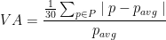

# Kin Rewards Engine (KRE) ||10

The Kin Rewards Engine incentivises developers to create amazing user experiences that utilize Kin.

Approved developers are incentivized via a shared `Daily Payout` that can be as high as 250,000,000 Kin. [Refer here for the most up to date `Daily Payout` value.](https://github.com/kinecosystem/rewards-engine/blob/master/current-KRE.md#the-daily-payout)

Developers can increase their possible portion of the `Daily Payout` by simply encouraging their users to obtain and spend Kin

Those developers who create the biggest consumer demand and use for Kin receive the biggest daily rewards. There are controls put in place to promote fairness for newer/smaller apps that reduce the possibility of a monopoly.

The `Daily Payout`s are sent to approved developers weekly.

## What Is The Daily Payout

The `Daily Payout` is the total amount of Kin paid to developers per day as summarized below.

The `Daily Payout` is set according to a budgeted amount called the `Daily Budget` along with an adjustment for volatility of the price of Kin.

The `Daily Budget` is currently set at 250,000,000 Kin (as of 10/12/2021). As the `Daily Budget` will be adjusted over time, [refer here for the most up to date value](https://github.com/kinecosystem/rewards-engine/blob/master/current-KRE.md#the-daily-payout).

The exact amount of the `Daily Payout` is calculated by multiplying the `Daily Budget` by the difference of 1 minus the `Volatility Adjustment` (VA).

```
Daily Payout = Daily Budget * (1 - Volatility Adjustment)
```

The `Volatility Adjustment` is a number ranging from 0 to 1 which represents the average amount of price volatility over the previous 30 days. The `VA` rises during times of high volatility to reduce excessive selling when Kin’s price rises rapidly or during a drop. The `VA` is designed to help Kin’s price appreciate.

For those who appreciate equations, here’s how the `VA` is calculated:



Where, `P` is the set of closing prices in the last 30 days and `Pavg` is the average price in the last 30 days.

## How Apps Earn Part of the Daily Payout

Apps earn Kin by encouraging their users to obtain and spend Kin which is proven by two important metrics:

1. **Active User Balance (`AUB`)** — the total amount of Kin held by an `Active User`
2. **Active User (`AU`)** — a user who spent Kin, in your app, 3 or more times in the previous 30 days

### How to Calculate One's Portion of the Daily Payout

The calculation is mathematically simple:

```
portion_of_daily_payout = (your_eligible_aub / ecosystem_aub) * daily_payout
```

Where `your_eligible_aub` is the smallest of either:

1. Sum of all active user balances divided by the number of active users
2. 100,000 \* number of active users (Effectively caps the amount of eligible `AUB`)

And where `ecosystem_aub` is the sum total of eligible `AUB` for all apps participating in the [KRE](/essentials/kin-rewards-engine/).

## How We Reduce Gaming and Prevent Monopolies

To be eligible to participate in the [KRE](/essentials/kin-rewards-engine/), apps must first build a functioning integration on the Testnet and then [apply for an AppIndex](/essentials/kre-app-registration/#register-your-app) in our Kin developer portal. By having a valid App Index, we are able to verify ecosystem apps’ Kin based transactions and user balances.

Apps are regularly audited, manually and programmatically (via transaction data), to ensure they are creating positive user experiences, are improving the overall Kin ecosystem, and are meeting our [Spend Checklist](/essentials/kre-checklist/#spend-checklist), [Developer Terms](https://kin.org/kin-developer-terms/), and [Terms of Use](https://kin.org/terms-and-conditions/) to remain eligible to receive rewards from the [KRE](/essentials/kin-rewards-engine/).

In order to prevent monopolies, no App will receive more than 66.67% of the `Daily Payout`. Furthermore, any developer that would have received more than 50% of the `Daily Payout` will have their portion of the `Daily Payout` adjusted.

No two apps ([AppIndexes](/essentials/terms-and-concepts/#app-index)) will receive more than 90% of the `Daily Payout` and residual payouts will be redistributed proportionally to remaining developers.

See below for a detailed example of how the “[Monopoly Clause](https://github.com/kinecosystem/rewards-engine/blob/master/current-KRE.md#monopoly-clause)” is calculated.

Let `s_1, s_2, …, s_n` be the [KRE](/essentials/kin-rewards-engine/) payout shares ordered by payout proportion in descending order before invoking the [monopoly clause](https://github.com/kinecosystem/rewards-engine/blob/master/current-KRE.md#monopoly-clause).

```
If (s_1 + s_2  > 0.90) or (s_1 > 0.5):
    If s_1 > 0.5:
        s_1' = 0.5 + ((s_1 - 0.5) / 0.5) * (2/3 - 1/2)
    Else:
        s_1' = s_1
    If s_1' + s_2  > 0.90 then:
        s_2' = s_2 / (s_1+s_2) * 0.9
    Else:
    	s_2' = s_2
    s_1’ = minimum(s_1' / (s_1'+s_2) * 0.9, s_1')
    If s_2’ != s_2:
        For i = 3 to n:
            s_i' = s_i / (sum from i = 3 to n of s_i) * 0.1
    Else:
        For i = 2 to n:
            s_i' = s_i / (sum from i = 2 to n of s_i) * (1 - s_1')
	Developers are paid out based on s_i'
Else:
	Developers are paid out based on s_i
```

**Example 1:**  
Payout shares before clause: `{0.35, 0.3, 0.2, 0.15}`  
Payout shares after clause: `{0.35, 0.3, 0.2, 0.15}`

**Example 2:**  
Payout shares before clause: `{0.90, 0.05, 0.03, 0.02}`  
Payout shares after clause: `{0.633, 0.183, 0.11, 0.073}`

**Example 3:**  
Payout shares before clause: `{0.50, 0.45, 0.03, 0.02}`  
Payout shares after clause: `{0.474, 0.426, 0.06, 0.04}`

**Example 4:**  
Payout shares before clause: `{0.55, 0.44, 0.01}`  
Payout shares after clause: `{0.486, 0.414, 0.06, 0.10}`

| Payout shares before clause | Payout shares after clause |
| --------------------------- | -------------------------- |
| `50%`                       | `50%`                      |
| `60%`                       | `53.33%`                   |
| `70%`                       | `56.67%`                   |
| `80%`                       | `60%`                      |
| `90%`                       | `63.33%`                   |
| `95%`                       | `65%`                      |


***
**Was this page helpful?**<br/>
If you'd like to tell us how we can make these docs better, let us know here:

<div class='contacts-index'>
  <a href='https://forms.gle/qhjcDJR59v8RJsaY7' target='_blank'><div class='contact'>
    
    <span class='contact-text'>Feedback</span>
  </div></a>
</div>


