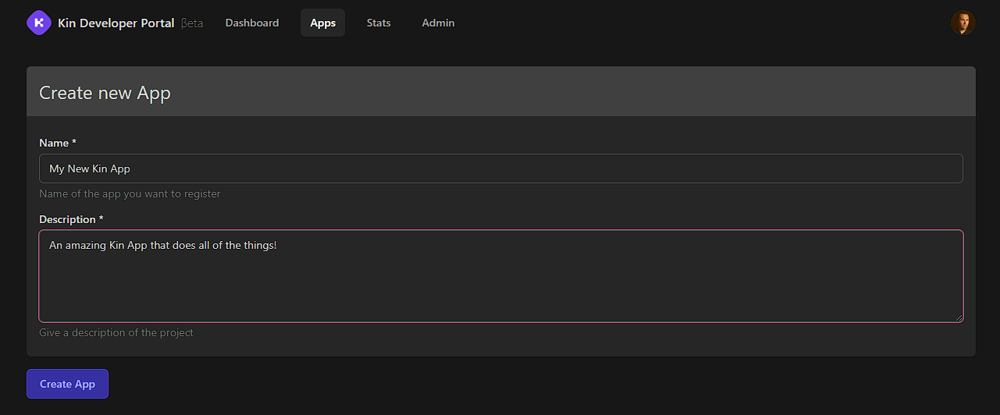
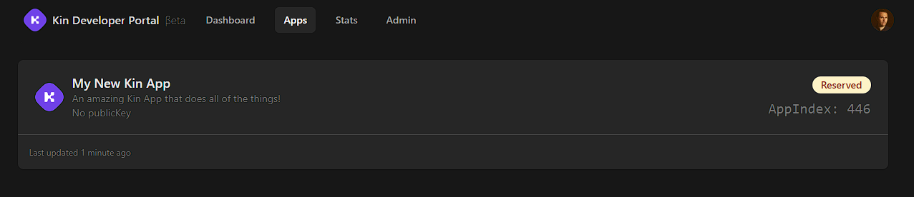
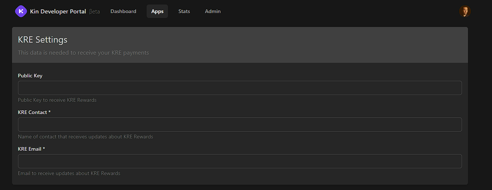
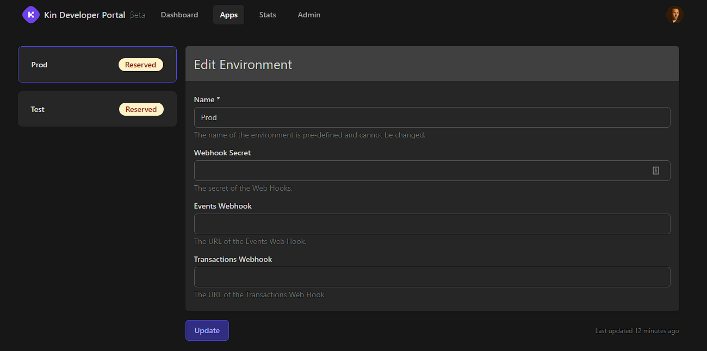

# KRE App Registration ||20

## Create an Account on the Kin Developer Portal
To earn Kin via the KRE, you have to have registered your App on our Kin Developer Portal.

We'll send an email to the account you used during registration. Open that email and follow the instructions to verify your account

  <a href='https://portal.kin.org/' target='_blank'>

    
    Developer Portal
  
</a>

## Register Your App
Go to Dashboard / Create App and fill in your App Details  

This will create your App and give you your all-important App Index. Your App Index is used to identify your transactions and make sure you get paid via the KRE.  

## Complete Your App Settings
Go to Settings and fill in all of the required information. Make sure you include your Public Key where you'd like KRE payments to go or we won't be able to activate your App.  

Congrats! Your App is now registered!

<!-- ## Configurable Options

After initial registration, the follow-up email will contain instructions on how to configure various options for their app. Below are descriptions of the options that can be configured when using Agora.

### Webhooks

The following options are configurable for developers interested in using [webhooks](/docs/how-it-works/#webhooks):

- **Webhook Secret**: Required for an App to make use of any [webhooks](/docs/how-it-works/#webhooks). This secret will be used by Agora to generate the `X-Agora-HMAC-SHA-256` [signature](/docs/agora-webhook-reference/#authentication) so that apps can verify the origin of the requests.
- **Sign Transaction URL**: The URL for Agora to send [Sign Transaction](/docs/how-it-works/#sign-transaction) webhook requests. Required to make use of the sign transaction webhook.
- **Events URL**: the URL for Agora to send [Events](/docs/how-it-works/#events) webhook requests. Required to make use of the events webhook. -->

## Updating Your Apps

If you update your App details (either Settings or Environments) in the [Kin Developer Portal](https://portal.kin.org/), make sure you let us know in the [dev-portal-support](https://discord.com/channels/808859554997469244/866647819913396224) channel on Discord so that we can update your App on our backend. If you don't, you might be missing out on your KRE rewards or not have your webhooks firing, etc.  

## What If I Get Stuck?

Fortunately, we have an amazing developer community on our Developer Discord server. Join today!

<a href='/essentials/getting-help/'>

    
    Getting Help
  
</a>
  <a href='https://discord.com/invite/kdRyUNmHDn' target='_blank'>

    
    Developer Discord
  
</a>

***
**Was this page helpful?** 
If you'd like to tell us how we can make these docs better, let us know here:

  <a href='https://forms.gle/qhjcDJR59v8RJsaY7' target='_blank'>

    
    Feedback
  
</a>

