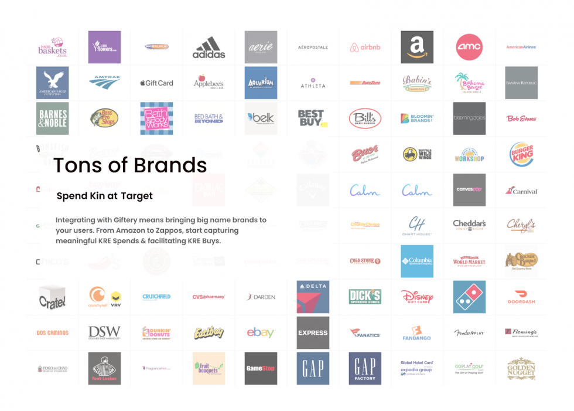
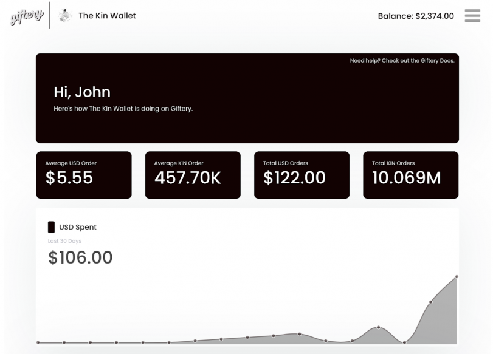

# Giftery

[Giftery](https://giftery.io) is an amazing ecommerce App built by the lovely folks at [Uproll](https://uproll.app/). It allows users to spend Kin to purchse virtual gift cards from from over 250 + major retailers, including: Airbnb, Amazon, Best Buy, Chipotle, Disney, DoorDash, Ebay, Gamestop, Hulu, Nike, Sephora, Starbucks, Uber, Walmart. Whole Foods, XBOX, and much more…

 

Best of all, [Giftery Vendor](https://giftery.io/vendor) enables developers to easily integrate Giftery into their own App's experience and add a new array of options for their users to spend their Kin in-app. For Kin apps which participate in the KRE, in-app Giftery transactions will natively count towards your KRE metrics!

 

If you are a developer, integrating Giftery into your own App is as easy as signing up, embedding Giftery or connecting via the API, loading your account with USD/USDC and accepting payments with Kin.  The Giftery dashboard allows you to track and query orders, analyze transaction data, add USD funds to your vendor account, and more! 

To get started, visit [Giftery Vendor](https://giftery.io/vendor), access the [Giftery Vendor Docs](https://giftery.snazzydocs.com/1.0/how-it-works) for a full introduction and functionality breakdown.

 
 

***
**Was this page helpful?** 
If you'd like to tell us how we can make these docs better, let us know here:

  <a href='https://forms.gle/qhjcDJR59v8RJsaY7' target='_blank'>

    
    Feedback
  
</a>

