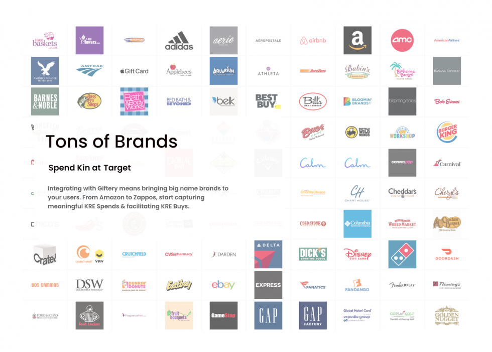
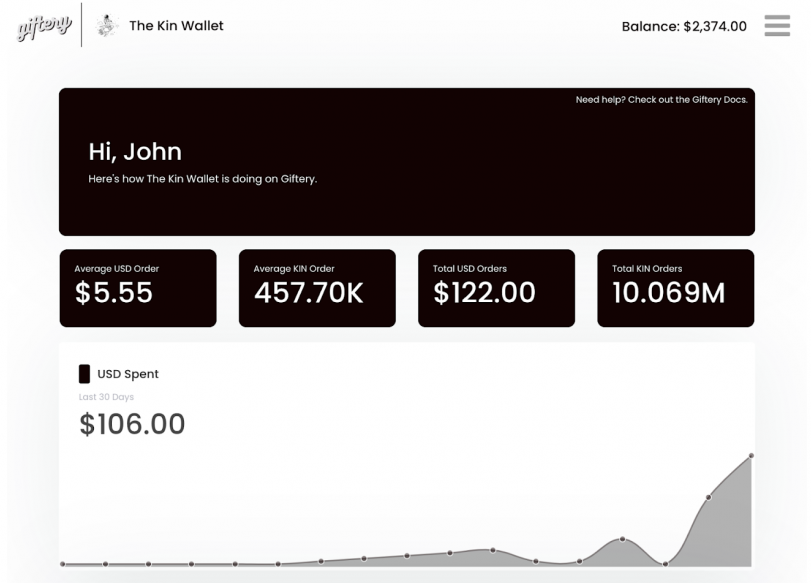
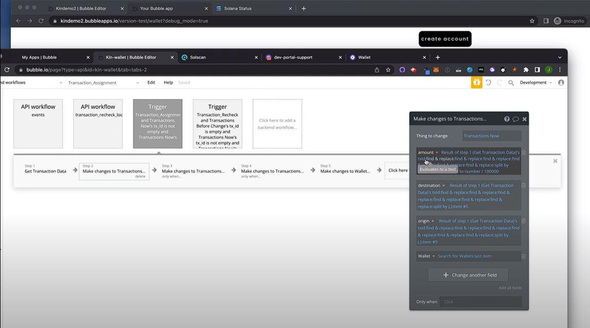

## Not A Developer?

Got a great idea for using Kin in an Application? Not a Coder? No Problem!

We think everyone should be able to build with Kin. 

If you think so too, check out our Kin No-Code Plugin!

## The Kin No-Code Plugin 

The amazing folks at [Uproll](https://uproll.app/) have created a [No-Code Kin plugin](https://thekinplugin.com/) for Bubble. 

[Bubble](https://bubble.io/) lets you create interactive, multi-user apps for desktop and mobile web browsers, including all the features you need to build a site like Facebook or Airbnb — all without writing a single line of code.

Don't believe us? Checkout out [giftery.io](https://giftery.io/) to see a powerful ecommerce app built by Uproll with the No-Code plugin.

 
 

The Uproll team created the Kin plugin for Bubble to make it even easier for developers to build innovative cryptocurrency based digital experiences that utilize Kin. If you’re interested in building within the Kin ecosystem but don’t have much coding experience, this Kin plugin is the perfect entry point!

Apps built with the Kin No-Code Plugin are also automatically compatible with the KRE! This is thanks to a customized version of the open source Kin SDK, created by the Uproll team.

With the Kin No-Code Plugin, developers have all the tools and resources at their disposal to build the innovative app they’ve always dreamed of, utilizing Kin, without the hurdles and barriers related to blockchain coding knowledge. 

## Kin Plugin Features:

- Zero Costs: The Kin No-Code Plugin is 100% free. Bubble also has a free tier to test out ideas.
- Hundreds of Templates: Free and Premium templates can give you a jumpstart on development.
- Thousand of Tools: From Airtable to Zapier, there are thousands of prebuilt tools that you can integrate into your bubble app with a click of a button.

## Docs and Tutorials

- Check out the [Docs](https://docs.thekinplugin.com/) to sign up and see how to get started.
- Check out this fantastic video tutorial to see a detailed 'How To' guide:

## Demo Apps
- Here's a lovely Demo App, [The Kin Wallet](https://thekinwallet.com/), created by Uproll, that you can use as a starting point for your own projects.
- Here's that link to [Giftery](https://giftery.io/), again, just because it's awesome.
- Here's another simple [Demo App](https://kin-nocode-demo.bubbleapps.io/version-test?debug_mode=true) showing some of the ways you can use Kin in your apps.

