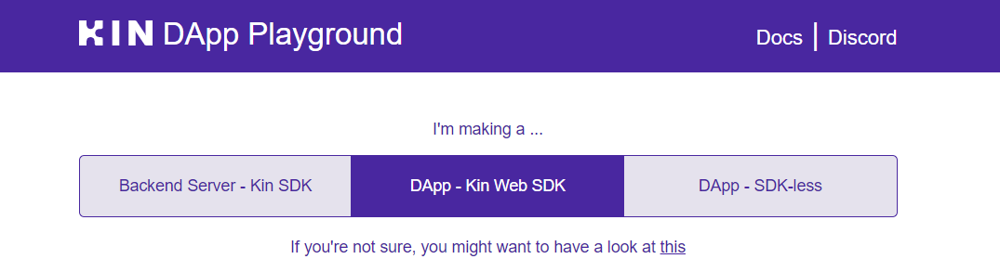
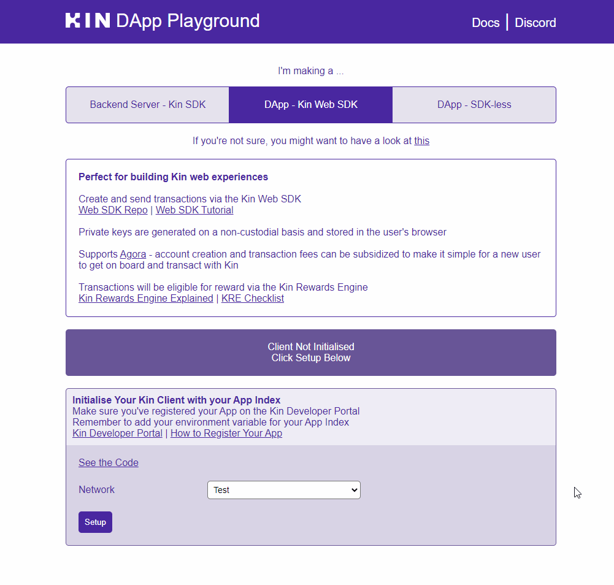

# Starter Kits

The starter kits are a quick way to gain an understanding of the SDKs. They are a basic implementation of the [SDKs](/sdks/) that you can add to your app to start experimenting with Kin.

If you're completely new to the ecosystem, we suggest [starting with one of the related tutorials](/tutorials/) and then leveraging the starter kits to see it all brought together in a minimal but functional app.

- [iOS](/starters/ios/)
- [Android / Kotlin](/starters/android-kotlin/)
- [Android / Java](/starters/android-java/)
- [Node](/starters/node/)
- [Go](/starters/go/)
- [Python](/starters/python/)
- [React Native](/starters/react-native/)
- [Web (React / Vue / Angular)](/starters/web/)

# DApp Playground / Demos

Our DApp Playground is a great place for you start playing with Kin as quickly and easily as possible.

A fully functional front-end, the Kin DApp Playground is split into three sections, one each for a different way of using Kin in applications: 

- Backend Server via Kin Server SDK (Node, Go, Python)
- Web DApp via Kin Web SDK
- Web DApp via SDK-less

## Repo
- [Kin DApp Playground](https://github.com/kin-starters/kin-dapp-playground)
## Server SDK Demos
- [Kin Node Demo](https://github.com/kin-starters/kin-demo-node-sdk)
- [Kin Python Demo](https://github.com/kin-starters/kin-demo-python-sdk)

## See it in action

