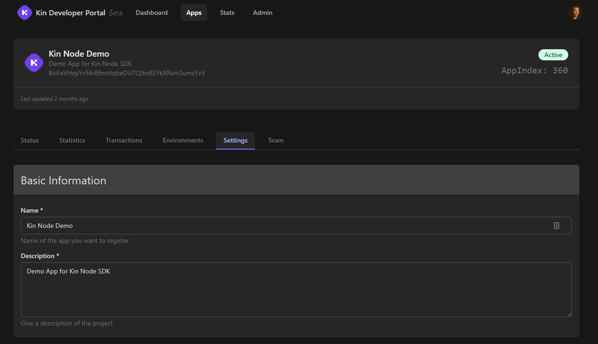

# Getting Help or Updating Your App ||130

## Kin Developer Discord
Our [Kin Developer Discord](https://discord.gg/kdRyUNmHDn) is a vibrant community of active Kin App developers, supported by members of the Kin Foundation as well as a host of Kin specialists and enthusiasts. It's a great place to come and get support for your app, whether you want help with integrating SDKs, to discuss the KRE, get feedback on your App or anything really!

We do have a few ground rules that you can find [here](https://discord.com/channels/808859554997469244/811112734758404116).

Some things we'd like to highlight are: 
- If you have issues / questions about a specific topic (e.g. Node SDK), then please use the channel for that topic. That way, we can all benefit from each others shared experiences. It's always better to keep discussions public rather than in a private chat, as long as there's no sensitive information being revealed.
- Don't '@' people unless it's absolutely necessary. We watch the channels so there's no need to notify us in that way.

## Updating Your Apps

If you update your App details (either Settings or Environments) in the [Kin Developer Portal](https://portal.kin.org/), make sure you let us know in the [dev-portal-support](https://discord.com/channels/808859554997469244/866647819913396224) channel on Discord so that we can update your app on our backend. If you don't, you might be missing out on your KRE rewards or not have your webhooks firing, etc.

